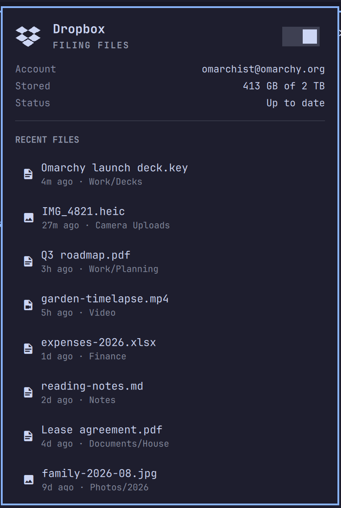

# Dropbox via Maestral



**Dropbox in the Omarchy bar, without the Dropbox daemon.** This is Omarchy's
built-in Dropbox widget, rewired to drive [Maestral](https://maestral.app),
the open-source Dropbox client written in Python.

It exists because the official Dropbox client only ships x86_64 binaries. On
the Apple Silicon build of Omarchy, and on any other ARM machine, Omarchy's
"Install Dropbox" entry cannot work. Maestral runs anywhere Python does.

What you get, in the same panel the stock widget draws:

- Link a Dropbox account, pause and resume syncing from the bar.
- Sync status straight from Maestral: up to date, syncing, paused, errors.
- Real storage usage from your account, not a guess from the plan name.
- Recently synced files from Maestral's sync history, one click to reveal in
  Nautilus.
- Keyboard driven like every Omarchy panel: `r` refresh, `l` login,
  `p` pause or resume, arrows and Enter for files.

## What you need

- Omarchy 4 (Quattro) with the omarchy-shell bar.
- Python 3.10 or newer on PATH as `python3`. Tested on Python 3.14, aarch64.
- Nautilus for the "reveal file" action. Omarchy installs it by default.

External dependencies, all installed by `install.sh` into a virtualenv and
nothing else: [Maestral](https://pypi.org/project/maestral/) from PyPI and
the packages it depends on. No sudo, no system packages, no AUR.

Every one of those packages is pinned to an exact version with sha256 hashes
in `requirements.txt`, and `install.sh` runs pip in hash-checking mode
(`--require-hashes`). A given plugin commit therefore always installs the same
reviewed artifacts; a new or tampered PyPI release cannot slip in. The pins
are resolved on Python 3.14, the version Omarchy ships.

The official Dropbox client must not be running for the same folder. Maestral
and Dropbox fighting over one directory ends badly.

## Install

```bash
omarchy plugin add https://github.com/ryankv/omarchy-maestral.git --enable
~/.config/omarchy/plugins/io.github.ryankv.omarchy-maestral/install.sh
```

`install.sh` puts Maestral into its own virtualenv at
`~/.local/share/maestral-venv`, links the `maestral` command into
`~/.local/bin`, and enables the widget. If a `maestral` command is already on
PATH, for example from the AUR package, it uses that instead.

Then click the Dropbox icon in the bar and choose **Login to Dropbox**. A
floating terminal walks you through Maestral's link flow: it opens the Dropbox
authorisation page, asks for the code Dropbox shows you, then asks where the
Dropbox folder should live and which folders to sync. When it finishes it
enables Maestral's systemd user unit, `maestral-daemon@maestral.service`,
and hands the daemon over to it so syncing continues after the window closes
and starts again on every login.

## Update

```bash
omarchy plugin update io.github.ryankv.omarchy-maestral
~/.config/omarchy/plugins/io.github.ryankv.omarchy-maestral/install.sh
```

Maestral itself is only ever updated by bumping the pins in `requirements.txt`
in this repository. Re-running `install.sh` after a plugin update installs
whatever version that commit pins. To refresh the pins yourself:

```bash
python3 -m venv /tmp/pip-tools && /tmp/pip-tools/bin/pip install pip-tools
printf 'maestral==1.9.6\n' > requirements.in   # set the version you want
/tmp/pip-tools/bin/pip-compile --generate-hashes --allow-unsafe --strip-extras \
  --output-file requirements.txt requirements.in
```

## Remove

```bash
~/.config/omarchy/plugins/io.github.ryankv.omarchy-maestral/uninstall.sh --purge
omarchy plugin remove io.github.ryankv.omarchy-maestral
```

`--purge` deletes the virtualenv and command link. Your Dropbox folder and
Maestral's config in `~/.config/maestral` are never touched.

## How it works

| File | Role |
|------|------|
| `Panel.qml` | The bar icon and panel. Almost untouched from the stock widget. |
| `Service.qml` | Runs the status helper on a timer and issues `maestral pause`, `resume`, `start`. |
| `status.py` | Talks to the Maestral daemon over its local RPC and prints one JSON object. |
| `link.sh` | The interactive first-run flow, run in a floating terminal. |
| `control.sh` | Pause, resume, and start. Starts through Maestral's systemd user unit when it is enabled. |
| `Model.js` | Formatting helpers, covered by `test/model-test.sh`. |

`status.py` is started with the system `python3`. If Maestral lives in a
virtualenv it re-executes itself with that virtualenv's interpreter, so the
same script works for a venv install and for a system package. Storage usage
is fetched from the Dropbox API at most every fifteen minutes and cached in
`~/.cache/omarchy-maestral`.

Everything else Maestral offers is available from the command line:
`maestral excluded` for selective sync, `maestral bandwidth-limit`,
`maestral ls`, `maestral sharelink`, and so on. Run `maestral --help`.

## Settings

| Key | Default | What it does |
|-----|---------|--------------|
| `refreshIntervalSec` | 60 | How often the panel polls Maestral, 10 to 3600 seconds. |

Set it on the widget's entry in `~/.config/omarchy/shell.json`, or through
the bar's widget settings.

## Notes

- Maestral is not affiliated with Dropbox. It uses the public Dropbox API
  with its own app key, so the first link asks you to authorise "Maestral".
- Maestral supports several accounts through config names. This widget
  follows the default `maestral` config. Set `MAESTRAL_CONFIG_NAME` in the
  shell's environment to point it elsewhere.
- Maestral has no Nautilus emblem integration. File status is in the panel
  and in `maestral filestatus <path>`.

## Credits

The panel, icon, and model come from the Dropbox widget in
[Omarchy](https://omarchy.org) by David Heinemeier Hansson and contributors.
The sync engine is [Maestral](https://github.com/samschott/maestral) by Sam
Schott.

## License

MIT. See [LICENSE](LICENSE).
